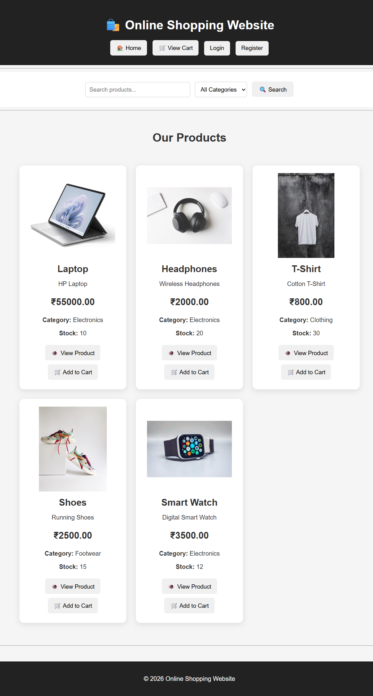
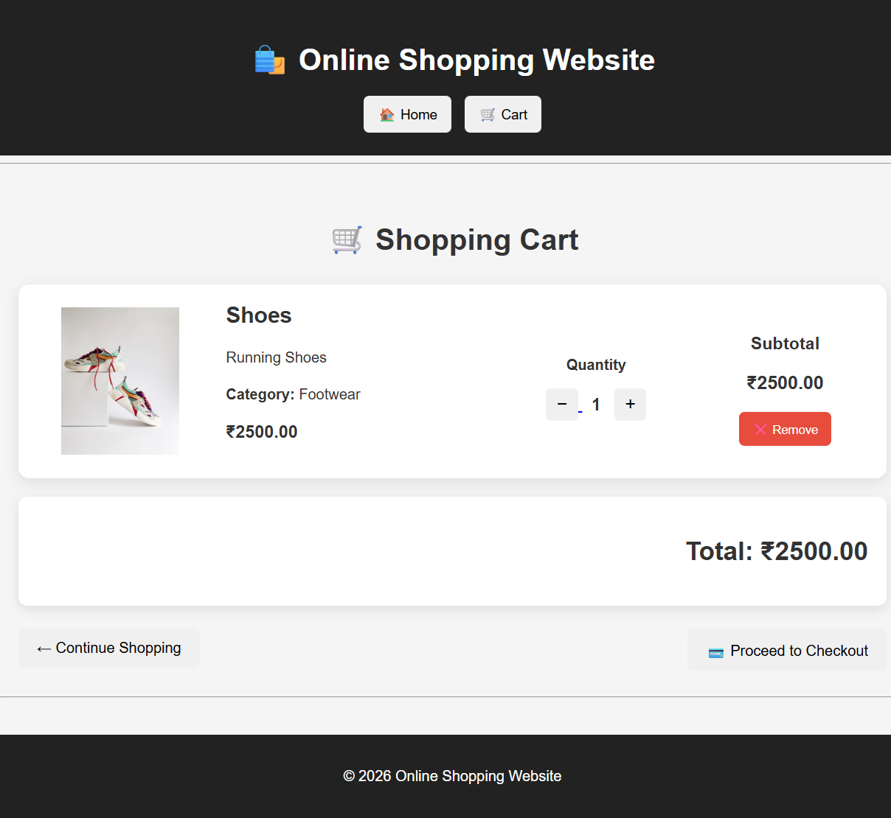
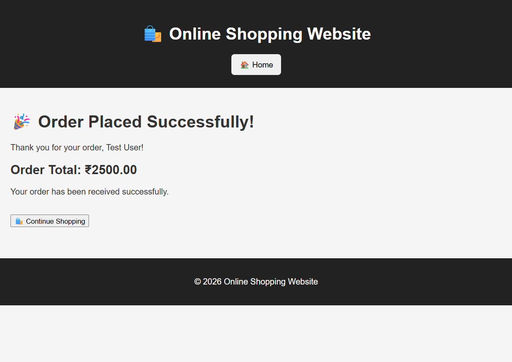

# 🛍️ Online Shopping Website

A simple online shopping website built using **Python, Flask, MySQL, HTML, and CSS**.

This project was created as a beginner-friendly web development project to practice Flask, database connectivity, user authentication, product management, and shopping cart functionality.

## 📌 Project Status

✅ Completed beginner-level e-commerce project

The application includes product browsing, search, category filtering,
shopping cart, user authentication, checkout, and order confirmation.

---

## 🚀 Features

- 🏠 Home page
- 🔍 Product search
- 📂 Category filtering
- 🖼️ Product images
- 📄 Product details
- 🛒 Add products to cart
- ➕ Increase product quantity
- ➖ Decrease product quantity
- ❌ Remove products from cart
- 💰 Automatic cart total calculation
- 👤 User registration
- 🔐 User login
- 🚪 User logout
- 💳 Simple checkout
- 🎉 Order confirmation
- 📱 Responsive design

---

## 🛠️ Technologies Used

- Python
- Flask
- MySQL
- HTML5
- CSS3
- Jinja2
- Git & GitHub

---

## 📁 Project Structure

```text
online_shopping/
│
├── static/
│   ├── css/
│   │   └── style.css
│   │
│   └── images/
│       ├── laptop.jpg
│       ├── headphones.jpg
│       ├── tshirt.jpg
│       ├── shoes.jpg
│       └── smartwatch.jpg
│
├── templates/
│   ├── index.html
│   ├── product.html
│   ├── cart.html
│   ├── checkout.html
│   ├── order_success.html
│   ├── login.html
│   └── register.html
│
├── app.py
├── database.py
├── .gitignore
└── README.md
```

├── app.py
├── database.py
├── .gitignore
└── README.md

---

## 📸 Screenshots

### 🏠 Home Page



### 🛍️ Product Details


### 🛒 Shopping Cart



### 🎉 Order Confirmation


